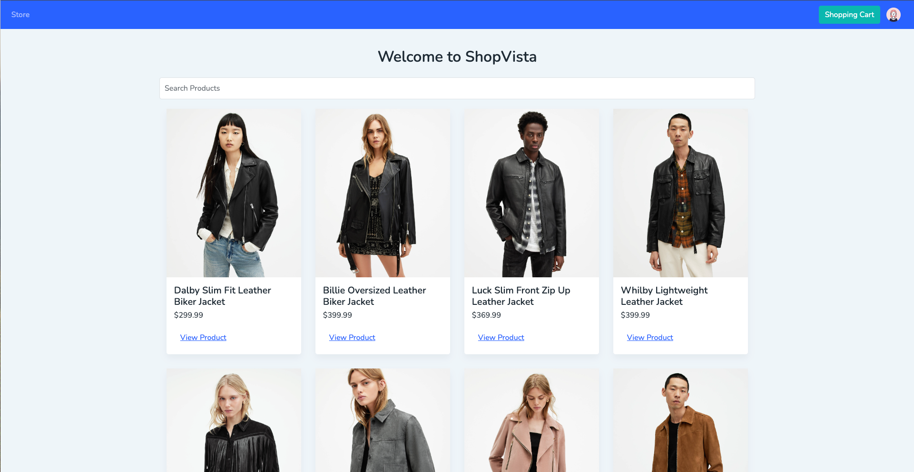

# ShopVista

ShopVista is a comprehensive e-commerce platform built with React for the frontend and Spring Boot for the backend. It features a user interface allowing users to browse products, add them to their cart, and proceed through a checkout process. The backend, developed with Spring Boot, manages user data, product inventory, order processing, and security.

## Features

- Product browsing
- Shopping cart functionalities
- User authentication and authorization
- Order management
- Payment integration
- Responsive design
- Admin panel for product and user management

## Technology Stack

- **Frontend**: React, React Router, Axios
- **Backend**: Spring Boot, Spring Security, JPA
- **Database**: MySQL
- **Others**: Maven, JWT for authentication, Bootstrap for styling

## Getting Started

These instructions will get you a copy of the project up and running on your local machine for development and testing purposes.

### Prerequisites

- [Java JDK](https://www.oracle.com/java/technologies/javase-jdk11-downloads.html) (11 or later)
- [Node.js and npm](http://nodejs.org)
- [MySQL](https://www.mysql.com/)
- IDE of your choice (IntelliJ IDEA, Eclipse, VSCode, etc.)

### Setting Up the Development Environment

#### Backend

1. Clone the repository to your local machine.
2. Open the backend project in your IDE.
3. Configure the `application.properties` file in the `src/main/resources` directory to point to your local MySQL instance:
    ```properties
    spring.datasource.url=jdbc:mysql://localhost:3306/ecommerce?useSSL=false&serverTimezone=UTC
    spring.datasource.username=root
    spring.datasource.password=password
    spring.jpa.hibernate.ddl-auto=update
    ```
4. Import the SQL dump file to set up the database schema and initial data:
   - Locate the `ecommerce.sql` file in the project directory.
   - Use a MySQL client or command line to import this file into your MySQL instance:
       ```bash
       mysql -u root -p your_database_name < path/to/ecommerce.sql
       ```
5. Run the application as a Spring Boot App.

#### Frontend

1. Navigate to the frontend directory in your terminal.
2. Install dependencies:
    ```bash
    npm install
    ```
3. Start the React application:
    ```bash
    npm start
    ```
4. Visit `http://localhost:3000` in your web browser.

## API Documentation

Detailed API documentation is available under the `/api-docs` path when the server is running, or you can browse the Postman collection included in the repository.

## Authors

**[Nabeel Thotti](https://github.com/NabeelThotti)**

## Sample Homepage


